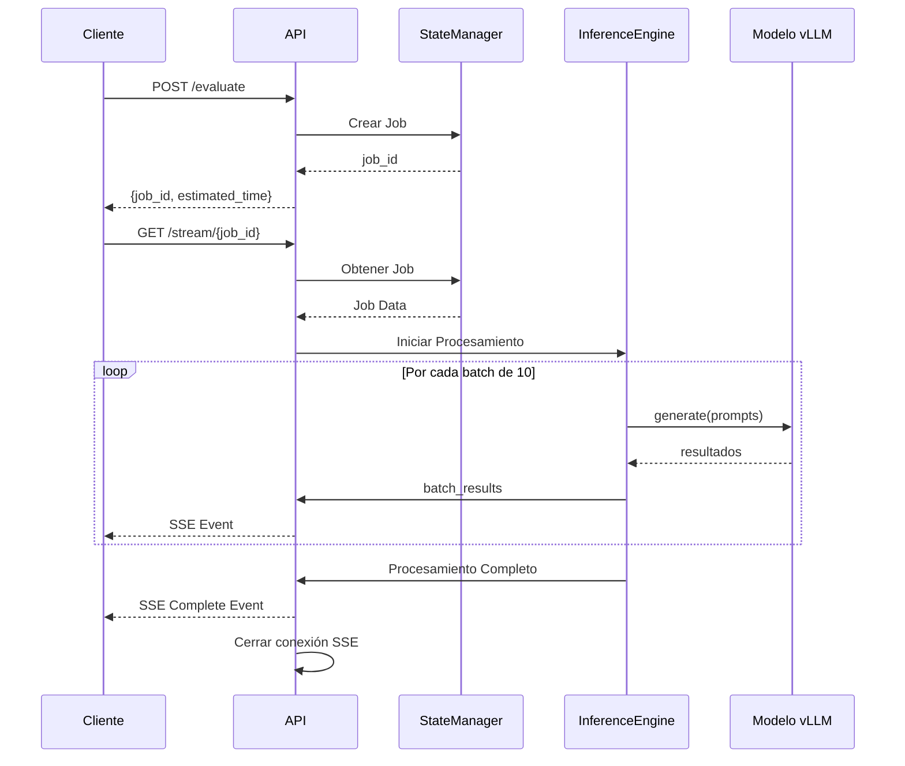

# Product Requirements Document (PRD)
## Servicio de Inferencia para Evaluación de Textos Educativos

### 1. Resumen Ejecutivo

**Proyecto**: API de Inferencia para Evaluación Automatizada de Textos  
**Versión**: 1.0 - Prueba de Concepto  
**Fecha**: Diciembre 2024  
**Stack Tecnológico**: Python (FastAPI + vLLM)  
**Deployment**: Docker en RunPod.io con GPU L40 (24GB VRAM)

### 2. Objetivos del Proyecto

#### 2.1 Objetivo Principal
Crear un servicio web que permita evaluar automáticamente textos de estudiantes utilizando el modelo `gemma2-9b-teacher-eval-nota-feedback` mediante vLLM, proporcionando notas (0-5) y feedback constructivo en catalán.

#### 2.2 Objetivos Específicos
- Procesar batches grandes (1000-2000 textos) de forma eficiente
- Proporcionar feedback en tiempo real mediante Server-Sent Events (SSE)
- Mantener una arquitectura simple y fácil de desplegar
- Optimizar el uso de recursos GPU para máximo throughput

### 3. Especificaciones Funcionales

#### 3.1 Capacidades del Sistema
- **Procesamiento en batch**: Hasta 2000 textos por petición
- **Streaming de resultados**: Eventos cada 10 inferencias completadas
- **Gestión en memoria**: Sin persistencia en base de datos
- **Formato de salida**: JSON estructurado con nota y feedback

#### 3.2 Limitaciones (Scope v1.0)
- Sin autenticación/autorización
- Sin persistencia permanente
- Sin gestión avanzada de errores
- Sin métricas detalladas
- Una única versión del modelo

### 4. Arquitectura del Sistema

```
┌─────────────────┐
│   Cliente Web   │
│  (JavaScript)   │
└────────┬────────┘
         │
    HTTP/SSE
         │
┌────────▼────────┐
│   FastAPI App   │
│                 │
│  ┌───────────┐  │
│  │  Routes   │  │
│  └─────┬─────┘  │
│        │        │
│  ┌─────▼─────┐  │
│  │   State   │  │
│  │  Manager  │  │
│  └─────┬─────┘  │
│        │        │
│  ┌─────▼─────┐  │
│  │Inference  │  │
│  │  Engine   │  │
│  └─────┬─────┘  │
└────────┬────────┘
         │
    ┌────▼────┐
    │  vLLM   │
    │  Model  │
    └─────────┘
```

#### 4.1 Componentes Principales

**FastAPI Application**
- Framework web asíncrono de alto rendimiento
- Soporte nativo para SSE
- Validación automática con Pydantic

**State Manager**
- Diccionario en memoria para almacenar trabajos
- TTL configurable para limpieza automática
- Thread-safe con asyncio locks

**Inference Engine**
- Wrapper sobre vLLM
- Procesamiento en batches optimizados
- Gestión de formato de prompts

### 5. Especificación de API

#### 5.1 POST /evaluate
**Descripción**: Envía un batch de textos para evaluación  
**Request Body**:
```json
{
  "items": [
    {
      "id_alumno": "string",
      "curso": "string",
      "consigna": "string",
      "respuesta": "string"
    }
  ]
}
```

**Response**:
```json
{
  "job_id": "uuid-v4",
  "total_items": 1500,
  "estimated_time_seconds": 300,
  "status": "queued",
  "stream_url": "/stream/{job_id}"
}
```

#### 5.2 GET /stream/{job_id}
**Descripción**: Stream SSE de resultados  
**Response**: Server-Sent Events

**Formato de evento (cada 10 items)**:
```json
{
  "event": "batch_complete",
  "data": {
    "batch_number": 1,
    "results": [
      {
        "id_alumno": "A001",
        "nota": 4,
        "feedback": "Bon treball per a 3r ESO..."
      }
    ],
    "progress": {
      "completed": 10,
      "total": 1500,
      "percentage": 0.67,
      "elapsed_seconds": 20,
      "estimated_remaining_seconds": 280,
      "avg_time_per_item": 2.0
    }
  }
}
```

**Evento final**:
```json
{
  "event": "complete",
  "data": {
    "total_processed": 1500,
    "total_time_seconds": 300,
    "status": "completed"
  }
}
```

#### 5.3 GET /health
**Descripción**: Health check del servicio  
**Response**:
```json
{
  "status": "healthy",
  "model_loaded": true,
  "gpu_available": true,
  "active_jobs": 2
}
```

### 6. Flujo de Trabajo



### 7. Estructura del Proyecto

```
text-evaluation-service/
├── Dockerfile
├── docker-compose.yml
├── requirements.txt
├── .env.example
├── README.md
├── app/
│   ├── __init__.py
│   ├── main.py              # FastAPI app principal
│   ├── config.py            # Configuración
│   ├── models.py            # Pydantic models
│   ├── routes/
│   │   ├── __init__.py
│   │   ├── evaluation.py   # Endpoints de evaluación
│   │   └── health.py       # Health checks
│   ├── services/
│   │   ├── __init__.py
│   │   ├── inference.py    # Motor de inferencia vLLM
│   │   ├── state.py        # Gestión de estado
│   │   └── formatter.py    # Formato de prompts
│   └── utils/
│       ├── __init__.py
│       └── timing.py       # Utilidades de timing
├── tests/
│   └── test_api.py
└── scripts/
    ├── start.sh            # Script de inicio
    └── test_client.py      # Cliente de prueba
```

### 8. Configuración y Variables de Entorno

```env
# Model Configuration
MODEL_NAME=carlosvillu/gemma2-9b-teacher-eval-nota-feedback
GPU_MEMORY_UTILIZATION=0.90
MAX_MODEL_LEN=1024
TENSOR_PARALLEL_SIZE=1
DTYPE=bfloat16

# API Configuration
HOST=0.0.0.0
PORT=8000
BATCH_SIZE=10
JOB_TTL_SECONDS=3600
MAX_CONCURRENT_JOBS=5

# Performance
ENABLE_PREFIX_CACHING=true
BLOCK_SIZE=16
MAX_NUM_SEQS=128
COMPILATION_LEVEL=2
```

### 9. Dockerfile

```dockerfile
FROM nvidia/cuda:12.1.0-runtime-ubuntu22.04

# Install Python and dependencies
RUN apt-get update && apt-get install -y \
    python3.11 \
    python3-pip \
    && rm -rf /var/lib/apt/lists/*

# Set working directory
WORKDIR /app

# Copy requirements
COPY requirements.txt .

# Install Python packages
RUN pip3 install --no-cache-dir -r requirements.txt

# Copy application
COPY app/ ./app/

# Create cache directories
RUN mkdir -p /tmp/vllm_cache /workspace/transformers /workspace/hub

# Environment variables for model caching
ENV HF_HOME=/workspace
ENV TRANSFORMERS_CACHE=/workspace/transformers
ENV HF_HUB_CACHE=/workspace/hub
ENV VLLM_USE_PRECOMPILED=1

# Expose port
EXPOSE 8000

# Health check
HEALTHCHECK --interval=30s --timeout=10s --start-period=60s \
  CMD curl -f http://localhost:8000/health || exit 1

# Start command
CMD ["python3", "-m", "uvicorn", "app.main:app", "--host", "0.0.0.0", "--port", "8000"]
```

### 10. Implementación Técnica - Componentes Clave

#### 10.1 State Manager (Pseudocódigo)
```python
class StateManager:
    def __init__(self, ttl_seconds=3600):
        self.jobs = {}
        self.locks = {}
        self.ttl = ttl_seconds
    
    async def create_job(self, job_data):
        job_id = str(uuid4())
        self.jobs[job_id] = {
            "id": job_id,
            "status": "queued",
            "data": job_data,
            "results": [],
            "created_at": time.time()
        }
        self.locks[job_id] = asyncio.Lock()
        return job_id
    
    async def update_job_results(self, job_id, batch_results):
        async with self.locks[job_id]:
            self.jobs[job_id]["results"].extend(batch_results)
            self.jobs[job_id]["processed"] = len(self.jobs[job_id]["results"])
```

#### 10.2 Inference Engine (Pseudocódigo)
```python
class InferenceEngine:
    def __init__(self, model_config):
        self.llm = LLM(**model_config)
        self.sampling_params = SamplingParams(
            temperature=0.1,
            top_p=0.95,
            max_tokens=200
        )
    
    async def process_batch(self, items, batch_size=10):
        prompts = [self.format_prompt(item) for item in items]
        
        for i in range(0, len(prompts), batch_size):
            batch = prompts[i:i+batch_size]
            start_time = time.time()
            
            outputs = await self.llm.generate(batch, self.sampling_params)
            
            results = self.parse_outputs(outputs, items[i:i+batch_size])
            elapsed = time.time() - start_time
            
            yield {
                "batch_results": results,
                "timing": {
                    "batch_time": elapsed,
                    "avg_per_item": elapsed / len(batch)
                }
            }
```

### 11. Consideraciones de Performance

#### 11.1 Optimizaciones GPU
- **Prefetch batching**: Preparar siguientes batches mientras se procesa el actual
- **Dynamic batching**: Ajustar tamaño de batch según latencia observada
- **KV cache management**: Configuración optimizada para L40

#### 11.2 Gestión de Memoria
- **Limpieza automática**: Jobs con TTL de 1 hora
- **Streaming results**: No acumular todos los resultados en memoria
- **Garbage collection**: Forzar GC después de jobs grandes

### 12. Testing y Validación

#### 12.1 Tests Unitarios
- Formato de prompts
- Parsing de respuestas del modelo
- Gestión de estado

#### 12.2 Tests de Integración
- End-to-end con mock model
- SSE streaming
- Concurrencia de jobs

#### 12.3 Tests de Carga
- 2000 items batch
- Múltiples clientes simultáneos
- Medición de throughput

### 13. Métricas de Éxito

- **Throughput**: ≥ 5 inferencias/segundo
- **Latencia P95**: < 3 segundos por inferencia
- **Memory footprint**: < 20GB RAM para 2000 items
- **GPU utilization**: > 80% durante procesamiento
- **SSE latency**: < 100ms por evento

### 14. Roadmap Futuro (v2.0)

- [ ] Autenticación con API keys
- [ ] Persistencia en PostgreSQL
- [ ] Queue system con Redis/Celery
- [ ] Métricas con Prometheus
- [ ] Multi-model serving
- [ ] WebSocket support
- [ ] Batch prioritization
- [ ] Result caching

### 15. Riesgos y Mitigaciones

| Riesgo | Probabilidad | Impacto | Mitigación |
|--------|--------------|---------|------------|
| OOM con batches grandes | Media | Alto | Chunking dinámico, límites configurables |
| Timeout en SSE | Baja | Medio | Keep-alive events, reconnect logic |
| Model loading failure | Baja | Alto | Health checks, restart policy |
| Concurrent job overload | Media | Medio | Job queue, rate limiting |

### 16. Decisiones de Diseño

1. **FastAPI sobre Flask**: Mejor soporte asíncrono y SSE nativo
2. **En memoria vs BD**: Simplicidad para PoC, menor latencia
3. **SSE vs WebSocket**: Simplicidad, unidireccional es suficiente
4. **Batch size 10**: Balance entre feedback frecuente y eficiencia
5. **Sin autenticación**: Servicio interno, simplicidad para PoC

---

**Aprobación**:  
Firma: ________________  
Fecha: ________________
